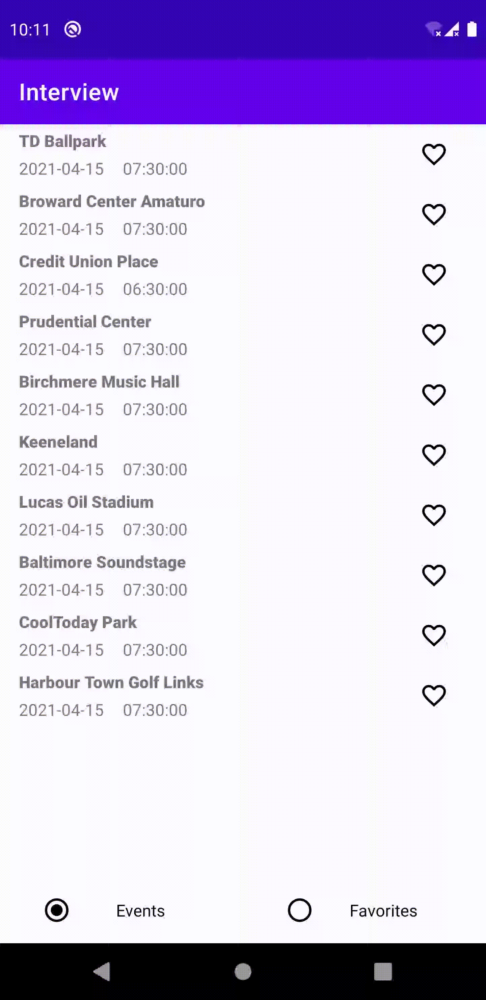

Test
====

App had written using Kotlin, Coroutines, Room, Retrofit, Koin in single gradle module according Clean Architecture(Data, Domain, Presentation layers) and MVVM for presentation layer.
There are some example tests (JUnit, Mockito, Espresso were used).

There are some tasks in the code that were not implemented due to the test application. The same situation with tests.

